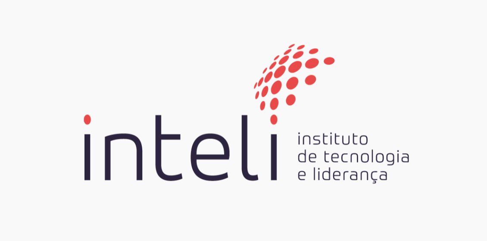

# Inteli - Instituto de Tecnologia e Liderança 





# Projeto IPT/Inteli 

## Scr(ipt)

## 🧑‍🎓 Integrantes: 
- <a href="https://www.linkedin.com/in/pedro-henrique-cruz-178a62227/">Pedro Cruz</a>
- <a href="https://www.linkedin.com/in/enzo-boccia-pagliara-30379a267/">Enzo Boccia</a>
- <a href="https://www.linkedin.com/in/sophianobrega/">Sophia Nóbrega</a> 
- <a href="https://www.linkedin.com/in/%C3%B3lin-medeiros-costa-b0a1b426a/">Ólin Costa</a> 
- <a href="https://www.linkedin.com/in/victorbarq/">Clara Mohammad</a>
- <a href="https://www.linkedin.com/in/victorbarq/">João Paulo da Silva</a> 
- <a href="https://www.linkedin.com/in/victorbarq/">Daniel Mendez</a>


## 🧑‍🏫 Professores: 

### Orientador(a) 

- Marcelo Gonçalves
### Instrutores 
- Victor Quiroz
- Fatima Toledo
- Francisco Escobar
- Henrique Paiva
## 📝 Descrição

O IPT possui uma área de pesquisa voltada para ferrovias, a qual realiza um projeto de coleta de dados do percurso de trens para algumas empresas clientes. No final do processo de coleta e tratamento dos dados, é produzido um relatório extremamente técnico e extenso contendo os resultados. No entanto, esse formato atual tem gerado diversas complicações com diferentes facetas. De um lado, os stakeholders possuem agendas extremamente apertadas e, portanto, não têm o tempo necessário para extrair dos relatórios os dados que eles precisam para realizar seus trabalhos de forma apropriada. Por outro lado, existem funcionários que necessitam de certas informações contidas no relatório, mas que simplesmente não possuem o conhecimento técnico necessário para extrair essas informações. Em suma, os relatórios no modelo atual estão prejudicando a eficiência da conexão entre o IPT e seus clientes.

Portanto, o objetivo central do projeto é criar uma aplicação que forneça informações sobre eventos registrados em determinados trajetos ferroviários, enfatizando pontos críticos e essenciais, tornando mais fácil o acesso e interpretação das informações. Portanto, será dividido em duas vertentes: uma com foco macro visando atingir pessoas não técnicas e outra direcionada a pessoas mais técnicas. 

## 📝Link
Clique [AQUI]("https://k36w85-9696.csb.app/") para ver o projeto rodando 

## 📁 Estrutura de pastas

|--> documentos<br>
  &emsp;| --> outros <br>
  &emsp;| T(8)_G(2)_V(1.0)_Web_application_document.pdf<br>
  &emsp;| T(8)_G(2)_V(1.0)_Web_application_document.docx<br>
|--> imagens<br>
|--> src<br>
  &emsp;|--> Backend<br>
  &emsp;|--> Frontend<br>
| readme.md<br>
| license.txt

Dentre os arquivos presentes na raiz do projeto, definem-se:

- <b>readme.md</b>: arquivo que serve como guia e explicação geral sobre o projeto (o mesmo que você está lendo agora).

- <b>documentos</b>: aqui estarão todos os documentos do projeto. Há também uma pasta denominada <b>outros</b> onde estão presentes aqueles documentos complementares ao <b>web application document</b>.

- <b>imagens</b>: imagens relacionadas ao projeto como um todo (por exemplo imagens do sistema, do grupo, logotipos e afins).

- <b>src</b>: nesta pasta encontra-se todo o código fonte do sistema (existem duas subpastas <b>backend</b> e <b>frontend</b> que contêm, respectivamente, o código do servidor e o código da página web).

## 💻 Configuração para desenvolvimento

Aqui encontram-se todas as instruções necessárias para a instalação de todos os programas, bibliotecas e ferramentas imprescindíveis para a configuração do ambiente de desenvolvimento.

1.  Baixar e instalar o node.js:  [https://nodejs.org/pt-br/](https://nodejs.org/pt-br/) (versão 16.15.1 LTS)
2. Clone o repositório em questão.
3.  No modo administrador, abra o "prompt de comando" ou o "terminal" e, após,  abra a pasta "src/backend" no diretório raiz do repositório clonado e digite o segundo comando:

```sh
npm install
```

Isso instalará todas as dependências definidas no arquivo <b>package.json</b> que são necessárias para rodar o projeto. Agora o projeto já está pronto para ser modificado. Caso ainda deseje iniciar a aplicação, digite o comando abaixo no terminal:

```sh
npm start
```
4. Agora você pode acessar a aplicação através do link http://localhost:3000/
5. O servidor está online.

## 🗃 Histórico de lançamentos

* 0.0.1 - 28/04/2023
    * Estudo de mercado (SWOT, Matriz de Risco e 5 Forças de Porter)
    * Criação de Wireframes
    * Idealização do projeto 
    * Apresentação Sprint 1 para o IPT 

* 0.0.2 - 14/05/2023
    * Estruturação da tabela de Banco de Dados 
    * Relatórios dos Endpoints 
    * Documentação da API 
    * Apresentação Sprint 2 para o IPT

* 0.0.3 - 22/05/2023
    * Implementaçãp dos dados de Front End
    * Implementaçãp dos dados de Guia de estilos
    * Testes A/B 
* 0.0.4 - 06/06/2023
    
    * Revisão geral (Front/Back)
    * Implementação de novas features a partir da pesquisa de usabilidade do usuário
* 0.0.5 - 20/06/2022
    * Publicação do projeto na WEB
    * Finalização da documentação 
    * Apresentação da Entrega Final ao IPT 

## 📋 Licença/License

<p xmlns:cc="http://creativecommons.org/ns#" xmlns:dct="http://purl.org/dc/terms/"><a property="dct:title" rel="cc:attributionURL" href="https://github.com/2023M2T8-Inteli/Projeto3">Projeto Scr(ipt) - IPT </a> by <a rel="cc:attributionURL dct:creator" property="cc:attributionName" href="https://github.com/2023M2T8-Inteli/Projeto3">Inteli, Clara Coelho Mohammad, Daniel Augusto Rivas Mendez, Enzo Boccia Pagliara, João Paulo da Silva, Olin Medeiros Costa, Pedro Henrique de Azevedo Coutinho Cruz, Sophia Nóbrega</a> is licensed under <a href="http://creativecommons.org/licenses/by/4.0/?ref=chooser-v1" target="_blank" rel="license noopener noreferrer" style="display:inline-block;">Attribution 4.0 International</a></p>

## 🎓 Referências

Aqui estão as referências usadas no projeto:

1. <https://creativecommons.org/share-your-work/>
2. Equipe do IPT -> Apresentações ao IPT
3. <https://www.ipt.br/institucional>
ADMIN@DBSCHEMA.COM. 
4. DbSchema | Professional GUI Client for Database Management. Disponível em: https://dbschema.com/. 
5. DB Browser for SQLite. Disponível em: https://sqlitebrowser.org/. 
6. SQLITE. SQLite Home Page. Disponível em: https://www.sqlite.org/index.html. 
7. MICROSOFT. Visual Studio Code. Disponível em: https://code.visualstudio.com/.
8. NODE.JS. Node.js. Disponível em: https://nodejs.org/en.
9. OPENAI. ChatGPT. Disponível em: https://chat.openai.com/. 
10. Poe - Fast, Helpful AI Chat. Disponível em: https://poe.com/.
11. IPT - Instituto de Pesquisas Tecnológicas. Disponível em: https://www.ipt.br/.
